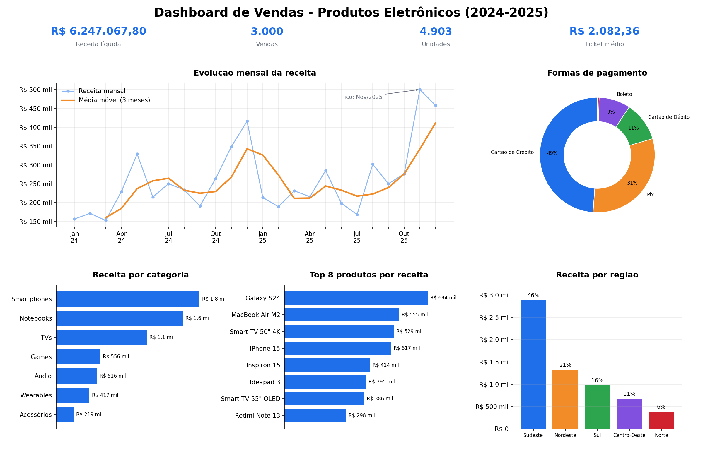

# 📊 Análise de Vendas de Produtos Eletrônicos

Projeto de análise exploratória de dados (EDA) em **Python**, usando **NumPy**, **Pandas** e **Matplotlib** para transformar um CSV de vendas em indicadores e gráficos que ajudam a responder perguntas de negócio.



> ⚠️ **Os dados são fictícios.** O CSV é gerado por `src/gerar_dados.py` com padrões realistas (sazonalidade, produtos mais populares, descontos na Black Friday), apenas para fins de estudo e portfólio.

---

## 🎯 Perguntas respondidas

- Quanto a loja faturou e qual é o ticket médio?
- Quais categorias e produtos geram mais receita?
- Como as vendas evoluem ao longo do tempo? Existe sazonalidade?
- Quais regiões e formas de pagamento predominam?
- O desconto realmente faz o cliente comprar mais unidades?

## 🛠️ Tecnologias

| Biblioteca | Como foi usada |
|---|---|
| **pandas** | leitura do CSV, limpeza, `groupby`, agregações, séries temporais |
| **numpy** | `np.select`, `np.where`, `np.percentile` (outliers), `np.corrcoef`, `np.convolve` (média móvel) |
| **matplotlib** | gráficos de barras, linha, rosca e dashboard com `GridSpec` |

## 📁 Estrutura do projeto

```
analise-vendas-eletronicos/
├── data/
│   └── vendas_eletronicos.csv      # base de dados (gerada)
├── src/
│   ├── gerar_dados.py              # gera o CSV fictício
│   └── analise_vendas.py           # limpeza, análises e gráficos
├── outputs/
│   └── graficos/                   # imagens geradas (PNG)
├── requirements.txt
└── README.md
```

## ▶️ Como executar

```bash
# 1. Clone o repositório
git clone https://github.com/SEU-USUARIO/analise-vendas-eletronicos.git
cd analise-vendas-eletronicos

# 2. Crie e ative um ambiente virtual
python -m venv .venv
.venv\Scripts\activate          # Windows
# source .venv/bin/activate     # Linux / macOS

# 3. Instale as dependências
pip install -r requirements.txt

# 4. (Opcional) gere um novo CSV
python src/gerar_dados.py

# 5. Rode a análise
python src/analise_vendas.py
```

Para apenas salvar os gráficos, sem abrir janelas: `python src/analise_vendas.py --nao-mostrar`

## 🔍 Etapas da análise

1. **Diagnóstico** – tamanho da base, período, nulos e duplicatas.
2. **Limpeza** – remoção de 10 linhas duplicadas e tratamento de 15 valores nulos em `forma_pagamento`.
3. **Feature engineering** – criação de `receita_bruta`, `valor_desconto`, `receita_liquida`, `ano_mes` e `faixa_desconto`.
4. **KPIs** – receita, número de vendas, unidades, ticket médio e mediana.
5. **Análises por dimensão** – categoria, produto, região, pagamento e tempo.
6. **Estatística com NumPy** – correlação, outliers (IQR) e crescimento anual.
7. **Visualização** – 6 gráficos individuais + 1 dashboard.

## 💡 Principais resultados

- **Receita líquida total:** R$ 6,25 milhões em 3.000 vendas (ticket médio de ≈ R$ 2.082).
- **Smartphones e Notebooks** concentram mais da metade da receita (≈ 54%).
- **Novembro (Black Friday) e dezembro** são os meses mais fortes; o pico foi em **nov/2025**.
- A receita cresceu **≈ 11% em 2025** em relação a 2024.
- **Sudeste** responde por ≈ 46% das vendas.
- **Cartão de crédito** (49%) e **Pix** (31%) dominam os pagamentos.
- Vendas com desconto acima de 10% têm em média **1,81 unidades** por venda, contra **1,56** sem desconto. A correlação é positiva, porém fraca (≈ 0,10).
- O ticket médio (R$ 2.082) é bem maior que a mediana (R$ 1.452): poucas vendas de alto valor puxam a média para cima.

## 🚀 Próximos passos

- [ ] Adicionar análise por estado (mapa de calor)
- [ ] Prever vendas futuras com regressão linear
- [ ] Criar dashboard interativo com Streamlit
- [ ] Analisar cohort de clientes

## 👤 Autor

**Seu Nome** · [LinkedIn](https://www.linkedin.com/in/SEU-PERFIL) · [GitHub](https://github.com/SEU-USUARIO)
